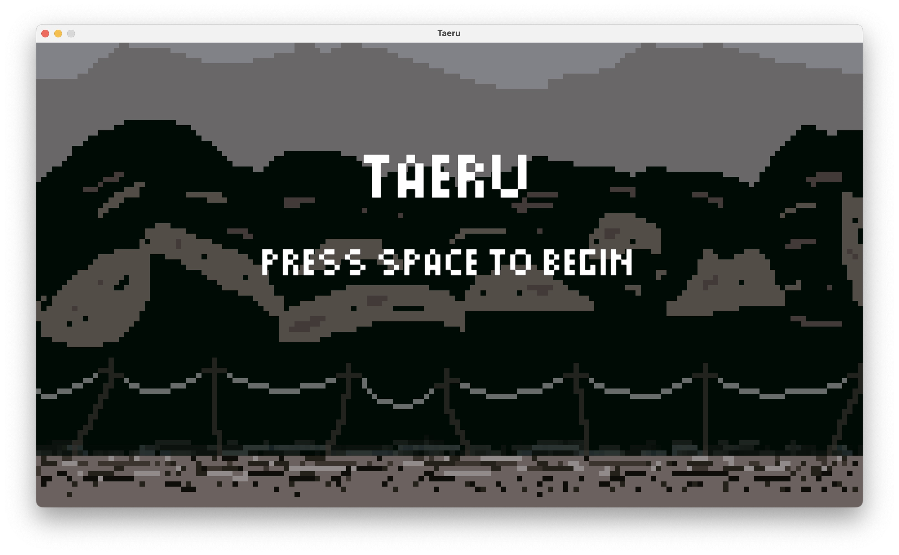
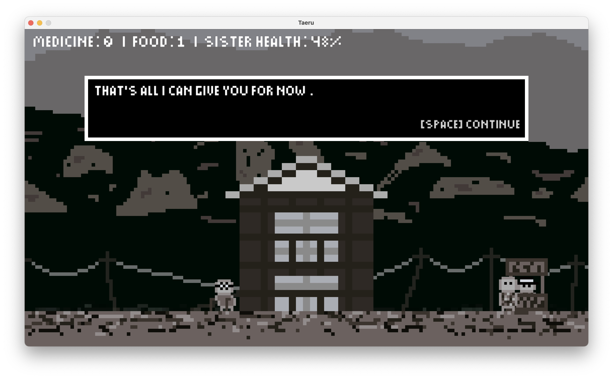

# Taeru
A short narrative game (~15 minutes) inspired by civilian life during WWII air raids in Japan.

## itch.io
Best experienced by playing. 
[Download on itch.io.](https://boosterball478.itch.io/taeru)

## Screenshots
#### Title Menu

#### Gameplay

## Installation
### 1. Clone the repository
    git clone https://github.com/CadenLau/Taeru.git
    cd ###
### 2. Create and activate virtual environment
#### macOS/Linux
    python3 -m venv venv
    source venv/bin/activate
#### Windows (PowerShell)
    python -m venv venv
    venv\Scripts\Activate.ps1
#### Windows (Command Prompt)
    python -m venv venv
    venv\Scripts\activate.bat
*Make sure you have Python 3.12+ installed. You can also upgrade pip to avoid dependency issues:*

    python -m pip install --upgrade pip
### 3. Install dependencies
    python -m pip install -r requirements.txt

## How to Run
    python main.py

## Usage
### Controls
| Key | Action |
| ----------- | ----------- |
| A | Move left |
| D | Move right |
| E | Interact with environment |
| Space | Scroll through dialogue |
| Escape | Toggle fullscreen |

## Features
- Short narrative-driven game (~15 minutes) focused on atmosphere and player pacing
- Minimal mechanics designed to intentionally emphasize emotional pacing and player reflection
- Environmental storytelling through NPC dialogue and everyday tasks
- Periodic air raid events that create urgency and tension
- Cutscenes at key emotional beats

## Project Structure
    ├── main.py
    ├── game_window.py
    ├── constants.py
    ├── assets/
    |   ├── fonts/
    |   ├── sounds/
    |   ├── sprites/
    |   └── tiles/
    ├── data/
    ├── entities/
    ├── gameplay/
    ├── utils/
    ├── views/
    ├── main.spec
    ├── requirements.txt
    ├── LICENSE.txt
    ├── .gitignore
    └── README.md

## Built With
- [Python Arcade](https://api.arcade.academy/en/latest/)
- [Pyglet](https://pyglet.readthedocs.io/en/latest/)

## License
This project is licensed under the Creative Commons Attribution–NonCommercial–ShareAlike 4.0 International License (CC BY-NC-SA 4.0).

You are free to play, share, and modify this project for non-commercial purposes, with appropriate attribution.

See [`LICENSE`](LICENSE.txt) file for details.